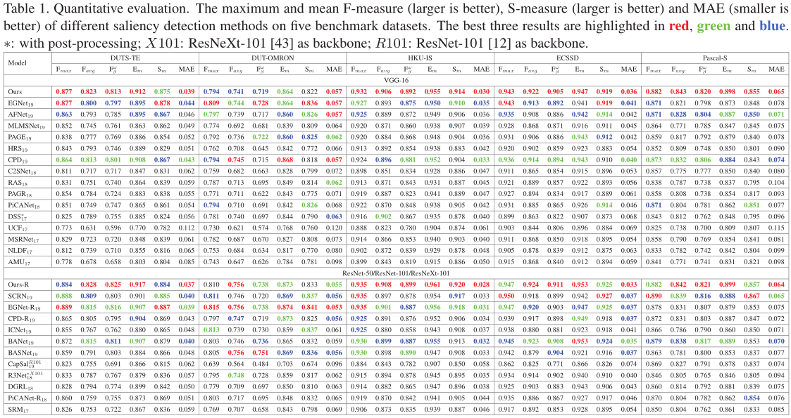

# Multi-scale Interactive Network for Salient Object Detection

The code and experimental results will be released soon.

## Abstract

> Deep-learning based salient object detection methods achieve great progress. However, the variable scale and unknown category of salient objects are great challenges all the time. These are closely related to the utilization of multi-level and multi-scale features. In this paper, we propose the aggregate interaction modules to integrate the features from adjacent levels, in which less noise is introduced because of only using small up-/down-sampling rates. To obtain more efficient multi-scale features from the integrated features, the self-interaction modules are embedded in each decoder unit. Besides, the class imbalance issue caused by the scale variation weakens the effect of the binary cross entropy loss and results in the spatial inconsistency of the predictions. Therefore, we exploit the consistency-enhanced loss to highlight the fore-/back-ground difference and preserve the intra-class consistency. Experimental results on five benchmark datasets demonstrate that the proposed method without any post-processing performs favorably against 23 state-of-the-art approaches. The source code will be publicly available at https://github.com/lartpang/MINet.

## Quantitative evaluation



## bibtex

```text
@inproceedings{MINet-CVPR2020,
    author = {Youwei Pang and Xiaoqi Zhao and Lihe Zhang and Huchuan Lu},
    title = {Multi-scale Interactive Network for Salient Object Detection},
    booktitle = CVPR,
    year = {2020}
}
```
